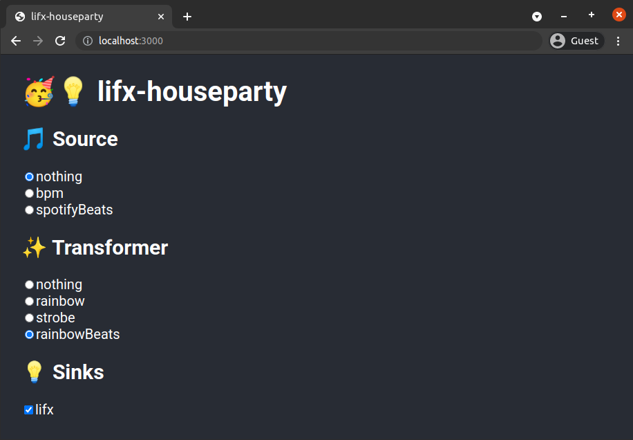

# lifx-houseparty

An app for do-it-yourself DJing, currently focused on lighting using Lifx smart lights, but extensible enough to control anything.



- `server`: the brains of the operation: coordinates syncing between sinks, sources and transformers
- `web`: a front-end built to control the server, that automatically generates UI based on the installed extensions' options

Extendible with interfaces for sinks, sources and transformers:
- a **sink** represents an output, for example a smart bulb
- a **source** represents an input, such as the Spotify API or a fixed beats-per-minute rate
- a **transformer** defines how the data from the source results in output to the sink, for example changing colour output at each beat input.

## Setup

Run the server:

```
cd server
npm i
npm start
```

Run the web app:

```
cd web
npm i
npm start
```